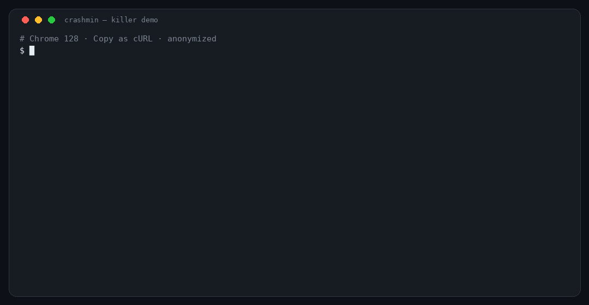

# CrashMin

**Failure-preserving HTTP request reduction.**

Paste a grotesque Chrome `Copy as cURL`. Say what “still broken” means. Get back a tiny request that still reproduces *your* failure.



```
12,441 bytes   →   117 bytes
1,053 pieces   →   6
99.06% smaller
same panic     →   YES (20/20)
```

```bash
curl -H 'x-crash-token: letmein' \
  -d '{"payload":{"deeply":{"nested":{"trigger":"boom"}}}}' \
  'http://127.0.0.1:18765/a'
```

That GIF is the product. Everything else is how to run it.

This is **not** a formatter and **not** a “make the response look the same” minimizer.

| Other tools ask | CrashMin asks |
| --- | --- |
| Is the response still *identical*? | Is it still *broken the way I said*? |

License: **MIT**.

---

## A real Chrome copy (anonymized)

[`corpus/repros/anonymized-chrome-saas.curl`](corpus/repros/anonymized-chrome-saas.curl) is a **Chrome 128 DevTools → Copy as cURL (bash)** of a workspace-settings save:

- lowercase header names, `priority`, `sec-ch-ua`, `--data-raw`
- next-auth / Stripe / Intercom / GA cookie *names*
- 24 members, feature flags, activity log

Hosts, bearer, emails, and IDs were replaced before it entered git. Replay is loopback-only so the crash is deterministic. How it was scrubbed: [corpus/ANONYMIZATION.md](corpus/ANONYMIZATION.md).

| | Bytes | What remains |
| --- | ---: | --- |
| Chrome copy, as pasted | **12,441** | 17 cookies, UTMs, 24 members, flags, activity |
| Header/cookie/query deletion only | 11,069 | almost the entire JSON body |
| **CrashMin** | **117** | one header + `payload.deeply.nested.trigger` |

Header strippers cannot see a nested JSON field. That leftover ~11 KB is the wedge.

```bash
python3 -m crashmin.fixtures --port 18765 &
python3 -m crashmin corpus/repros/anonymized-chrome-saas.curl \
  --status 500 \
  --body-regex 'panic: nil pointer' \
  --final-confirm 20 \
  --compact
```

Or the packaged walkthrough: `bash scripts/demo.sh`.

## Install

Python 3.10+, no runtime dependencies.

```bash
pip install git+https://github.com/robbyczgw-cla/crashmin.git
```

```bash
pip install .   # from a clone
crashmin --help
```

## For coding agents

Unix CLI. No MCP, no SDK, no daemon.

```bash
crashmin req.curl --status 500 --body-regex 'panic' --json --quiet -o min.curl
```

`--json` writes **one** object to stdout (`schema: 1`). `crashmin --schema` prints the schema. Exit `0` means use `.minimized.curl`. Anything else, read `.error_code`.

Contract: [docs/agents.md](docs/agents.md) · [AGENTS.md](AGENTS.md)

## Safety — read this

CrashMin **sends the request many times**. It will mutate whatever you point it at.

- **Default: loopback only.** Anything else is refused.
- Use a local or staging target. **Never production.**
- `--allow-remote` means you accept the blast radius.
- Use `--confirm N` on flaky or non-idempotent endpoints.
- A `Copy as cURL` is a session dump. Do not commit one, do not paste one into an issue.

[docs/safety.md](docs/safety.md) · [docs/privacy.md](docs/privacy.md).

## Usage

```bash
crashmin request.curl --status 500 --body-regex 'panic: nil pointer'
crashmin request.http --status '>=500'
crashmin capture.har  --body-contains 'INTERNAL ERROR'
crashmin request.curl --oracle ./interesting.sh --confirm 5
```

Input is auto-detected: `curl …`, raw HTTP, or HAR (first entry, or `--har-index N`).

Minimized request → **stdout**. Scoreboard → **stderr**.

```bash
crashmin req.curl --status 500 > min.curl
```

### Oracles (AND-combined; at least one required)

| Flag | Interesting when |
| --- | --- |
| `--status 500` / `'>=500'` / `5xx` | status matches |
| `--body-contains TEXT` | body contains the literal |
| `--body-regex REGEX` | body matches |
| `--header NAME=VALUE` | response header matches |
| `--timeout-is-failure` | the client timed out |
| `--oracle SCRIPT` | script exits 0 |

`--confirm N` — keep a candidate only if it fails **N/N** times.
`--final-confirm N` — re-send the answer N times and print `same failure: YES (N/N)`.

Full contract: [docs/oracles.md](docs/oracles.md).

### What it shrinks

HTTP structure, top-down — never raw bytes:

headers → cookies → query → form fields → nested JSON → primitives → path (carefully)

`Host` and `Content-Length` are rebuilt on the way out.

v0.1 does **not** shrink multipart or mystery content types.

## When this is worth it

Worth it when the crash lives in **JSON shape** and the paste is huge.

Not worth it when the bug is “needs `Authorization`” — delete that header by hand, or use [curlmin](https://github.com/noperator/curlmin).

[corpus/REPORT.md](corpus/REPORT.md) · [docs/competition.md](docs/competition.md)

## Not this project

Not a Burp/Postman replacement, proxy, scanner, fuzzer, dashboard, or cloud service. A reducer.

## Library

```python
from crashmin.detect import parse_input
from crashmin.executor import Executor
from crashmin.oracle import compile_oracle
from crashmin.reduce import reduce_request

req = parse_input(open("request.curl").read())
oracle = compile_oracle(statuses=["500"], body_regexes=[r"panic: nil pointer"])
result = reduce_request(req, Executor(oracle=oracle, confirm=5))
print("\n".join(result.summary_lines()))
```

## Develop

```bash
pip install -e '.[dev]'
pytest -q
python scripts/bench.py        # benchmarks/report.md
python scripts/corpus.py       # corpus/REPORT.md
python scripts/record_demo.py  # docs/demo.gif (needs Pillow + ffmpeg)
```

Toy crash servers: `python3 -m crashmin.fixtures --port 18765` (`POST /a`–`/e`, `GET /f`).

## License

[MIT](LICENSE). Use it, fork it, vendor it. Keep the copyright notice.
